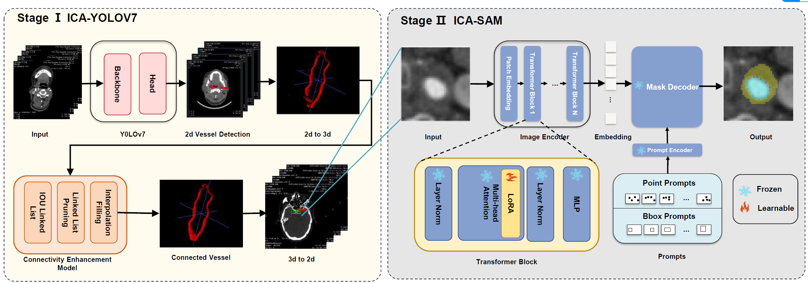

# ICA-SAMv7

code repository for [ICA-SAMv7](https://www.sciencedirect.com/science/article/pii/S0895611125000643)

## Abstract
Internal carotid artery (ICA) stenosis is a life-threatening occult disease. Utilizing CT to examine vascular lesions such as calcified and non-calcified plaques in cases of carotid artery stenosis is a necessary clinical step in formulating the correct treatment plan.  
Segment Anything Model (SAM) has shown promising performance in image segmentation tasks, but it performs poorly for carotid artery segmentation. Due to the small size of the calcification and the overlapping between the lumen and calcification. These challenges lead to issues such as mislabeling and boundary fragmentation, as well as high training costs. To address these problems, we propose a two-stage Internal Carotid Artery lesion segmentation method called ICA-SAMv7, which performs coarse and fine segmentation based on the YOLOv7 and SAM model. 
Specifically, in the first stage (ICA-YOLOv7), we utilize YOLOv7 for coarse vessel recognition, introducing connectivity information to improve accuracy and achieve precise localization of small target artery vessels. In the second stage (ICA-SAM), we enhance SAM through data augmentation and an efficient parameter fine-tuning strategy. This improves the segmentation accuracy of fine-grained substances in blood vessels while saving training costs. Ultimately, the accuracy of lesion segmentation under the SAM model was increased from the original 48.62% to 82.55%. Extensive comparative experiments have demonstrated the outstanding performance of our algorithm.

## Structure



Whole Structure of Our Method. In stage Ⅰ, we use YOLOv7 to make coarse artery detection and use the Connectivity Enhancement Model to add connectivity information to improve the accuracy of YOLO segmentation result. In stage Ⅱ, we use LoRA to finetune SAM so that we can get a suitable model for our project.


## Installation

Clone the repository locally.

```bash
git clone https://github.com/BessiePei/ICA-SAMv7.git
```
Create the conda env. The code requires `python>=3.7`, as well as `pytorch>=1.7` and `torchvision>=0.8`. Please follow the instructions [here](https://pytorch.org/get-started/previous-versions/) to install both PyTorch and Torchvision dependencies. Installing both PyTorch and TorchVision with CUDA is strongly recommend.
```bash
conda create -n ICA-SAMv7 python=3.9
conda activate ICA-SAMv7
pip install peft==0.7.1
pip install albumentations
pip install scikit-image
pip install matplotlib
```

## Stage Ⅰ: ICA-YOLOv7
```bash
cd ./ICA-YOLOv7
```
### Preparation
Download pretrained weights from [yolov7_weights.pth](https://github.com/bubbliiiing/yolov7-pytorch/releases/download/v1.0/yolov7_weights.pth).

Prepare dataset for the project as VOC dataset structure. Use `python voc_annotation.py` to get dataset list.

### Train

```bash
python train.py
```
### Predict
Change the `model_path` in `yolo.py` to the result weights file path.
```bash
python predict.py
```

### Connectivity Enhancement
```bash
python connectivity_enhance.py
```

## Stage Ⅱ: ICA-SAM

```bash
cd ./ICA-SAM
```
Download pretrained weights from [ica-sam.pth](https://drive.google.com/file/d/1ARiB5RkSsWmAB_8mqWnwDF8ZKTtFwsjl/view?usp=drive_link).

### Train

```bash
python train.py
```


### Test

```bash
python test.py
```


## License
This project is released under the [Apache 2.0 license](LICENSE).

## Acknowledgement
- We thank all medical workers for preparing dataset for our work.
- Thanks to the open-source of the following projects: [YOLOv7](https://github.com/WongKinYiu/yolov7), [Segment Anything](https://github.com/facebookresearch/segment-anything) , [SAM-Med2D](https://github.com/OpenGVLab/SAM-Med2D).

## Citation
```
@article{YAN2025102555,
title = {ICA-SAMv7: Internal carotid artery segmentation with coarse to fine network},
journal = {Computerized Medical Imaging and Graphics},
volume = {123},
pages = {102555},
year = {2025},
issn = {0895-6111},
doi = {https://doi.org/10.1016/j.compmedimag.2025.102555},
url = {https://www.sciencedirect.com/science/article/pii/S0895611125000643},
author = {Xiaotian Yan and Yuting Guo and Ziyi Pei and Xinyu Zhang and Jinghao Li and Zitao Zhou and Lifang Liang and Shuai Li and Peng Lun and Aimin Hao},
keywords = {Medical image segmentation, Segment anything model, Yolov7, Carotid artery stenosis}
}
```
